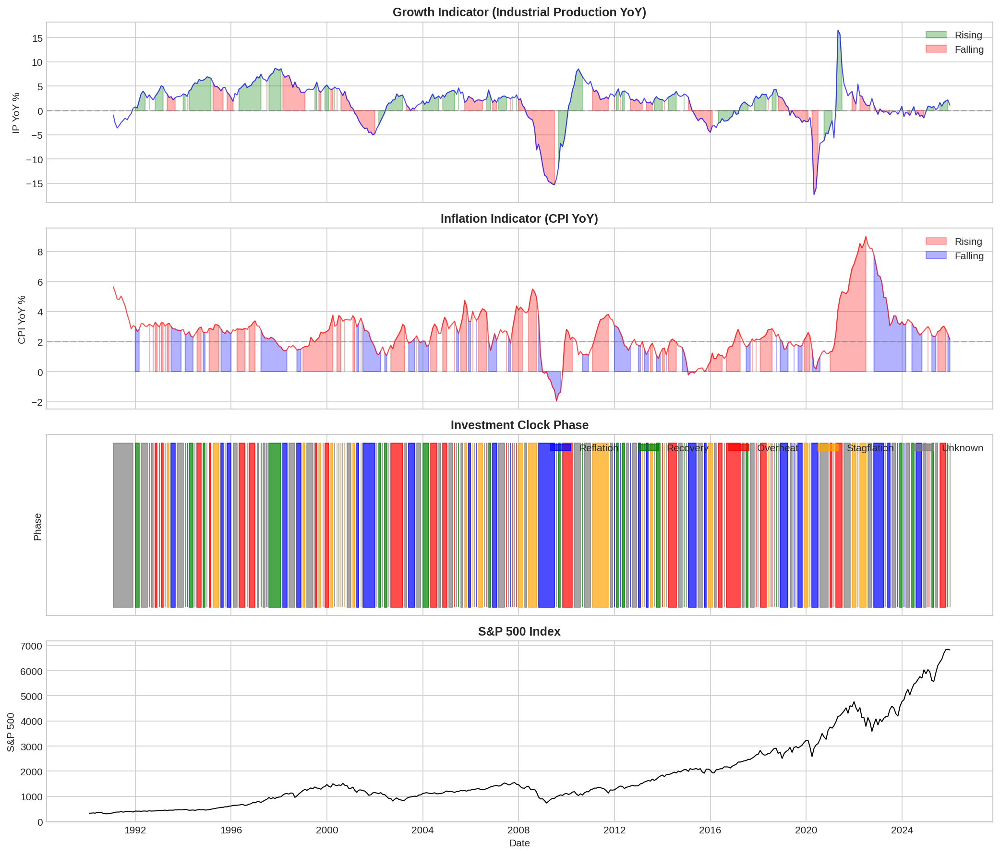
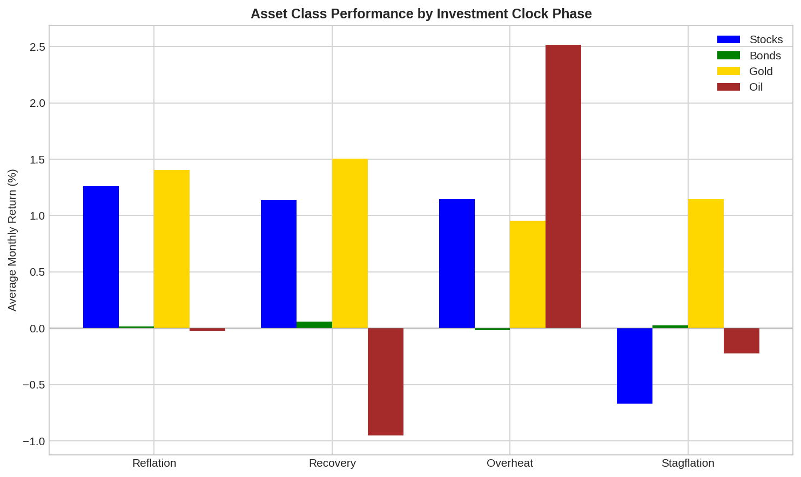

# Exploratory Analysis Findings

## Data Collection Summary

### Price Data (Yahoo Finance)
- **Period**: 1990-01-02 to 2025-12-13
- **Total days**: 9,060

| Asset | First Available |
|-------|----------------|
| S&P 500 | 1990-01-02 |
| NASDAQ | 1990-01-02 |
| Russell 2000 | 1990-01-02 |
| 10Y Treasury Yield | 1990-01-02 |
| VIX | 1990-01-02 |
| SPY ETF | 1993-01-29 |
| Crude Oil | 2000-08-23 |
| Gold | 2000-08-30 |
| TLT (20Y Bond ETF) | 2002-07-30 |
| GLD (Gold ETF) | 2004-11-18 |
| DBC (Commodity ETF) | 2006-02-06 |

### Economic Data (FRED)
- **15 series fetched successfully**
- **Key indicators**: GDP, CPI, Industrial Production, Unemployment, Fed Funds, Yield Curve

## Investment Clock Phase Classification

### Methodology
- **Growth indicator**: Industrial Production YoY % change
- **Inflation indicator**: CPI YoY % change
- **Signal method**: Momentum (above/below 6M and 12M moving averages)

### Phase Distribution (1990-2025)

| Phase | Months | Percentage |
|-------|--------|------------|
| Unknown | 143 | 34.0% |
| Reflation | 86 | 20.5% |
| Overheat | 82 | 19.5% |
| Stagflation | 59 | 14.0% |
| Recovery | 50 | 11.9% |

**Note**: High "Unknown" percentage (34%) indicates periods where momentum signals are mixed (not clearly rising or falling for both indicators).

### Average Phase Duration

| Phase | Mean (months) | Std Dev | Min | Max | Count |
|-------|---------------|---------|-----|-----|-------|
| Overheat | 2.9 | 1.9 | 0.9 | 8.1 | 29 |
| Reflation | 2.8 | 2.0 | 1.0 | 9.1 | 31 |
| Stagflation | 2.5 | 1.8 | 0.9 | 9.1 | 24 |
| Recovery | 2.1 | 1.3 | 0.9 | 7.1 | 24 |

**Finding**: Average phase duration is ~2.5 months, much shorter than the theoretical ~20 months mentioned in original ML research. This suggests:
1. Our momentum-based classification is more sensitive/noisy
2. Modern economic cycles may be more volatile
3. The 6M/12M MA thresholds may need tuning

## Asset Performance by Phase

### Average Monthly Returns (%)

| Phase | Stocks | Gold | Oil | Bonds |
|-------|--------|------|-----|-------|
| Reflation | 1.26 | 1.41 | -0.03 | 0.01 |
| Recovery | 1.14 | 1.50 | -0.95 | 0.06 |
| Overheat | 1.15 | 0.96 | 2.52 | -0.02 |
| Stagflation | -0.67 | 1.15 | -0.22 | 0.03 |

### Observed vs. Expected Rankings

| Phase | Observed Ranking | Expected (Theory) |
|-------|------------------|-------------------|
| Reflation | Gold > Stocks > Bonds > Oil | **Bonds** > Cash > Stocks > Commodities |
| Recovery | Gold > Stocks > Bonds > Oil | **Stocks** > Bonds > Cash > Commodities |
| Overheat | **Oil** > Stocks > Gold > Bonds | **Commodities** > Stocks > Cash > Bonds |
| Stagflation | Gold > Bonds > Oil > Stocks | **Cash** > Commodities > Bonds > Stocks |

### Key Observations

1. **Overheat phase matches theory well**: Oil (commodity) clearly outperforms, and bonds underperform
2. **Stagflation partially matches**: Stocks significantly underperform (-0.67%), gold acts as safe haven
3. **Reflation/Recovery diverge from theory**: Gold outperforms in both, bonds show minimal returns
4. **Gold consistently strong**: Performs well across all phases (0.96% to 1.50%)
5. **Bond returns appear muted**: Using yield change as bond return proxy may understate actual bond returns

## Visual Analysis

### Investment Clock Phases Over Time

Key observations from the chart:
- **2008 GFC**: Clear Reflation period (falling growth, falling inflation)
- **2020 COVID**: Sharp spike in Industrial Production recovery, followed by Overheat (high inflation)
- **2021-2022**: Extended Overheat/Stagflation due to post-COVID inflation surge
- **2010-2019**: Long period of mixed signals ("Unknown") - low volatility era

### Asset Performance by Phase

## Implications for ML Enhancement

### Issues with Traditional Approach

1. **High "Unknown" rate (34%)**: Need better phase classification
2. **Short phase durations**: Either over-sensitive or economic reality has changed
3. **Bonds underperforming in Reflation**: May need different bond proxy or additional factors
4. **Gold's universal strength**: Not well captured by traditional 4-asset framework

### Opportunities for Improvement

1. **Reduce "Unknown" phases**:
   - Use probabilistic phase assignment
   - Consider more indicators
   - Apply smoothing or regime detection algorithms

2. **Improve phase boundaries**:
   - Data-driven thresholds (clustering)
   - Hidden Markov Models for regime detection
   - Consider rate of change, not just level

3. **Expand asset coverage**:
   - Add cash/money market returns
   - Include real estate (REITs)
   - Consider currency effects

4. **Feature engineering**:
   - Yield curve shape (not just spread)
   - Credit spreads
   - Leading indicators
   - Sentiment data

## Data Files Generated

| File | Description |
|------|-------------|
| `data/prices.parquet` | Daily price data from Yahoo Finance |
| `data/fred_data.parquet` | Economic indicators from FRED |
| `data/monthly_with_phases.parquet` | Monthly dataset with phase classification |
| `data/phase_durations.csv` | Phase duration statistics |
| `data/investment_clock_phases.png` | Phase visualization over time |
| `data/returns_by_phase.png` | Asset returns by phase bar chart |
| `data/economic_indicators.png` | Economic indicators dashboard |

---
*Analysis Date: 2025-12-13*
