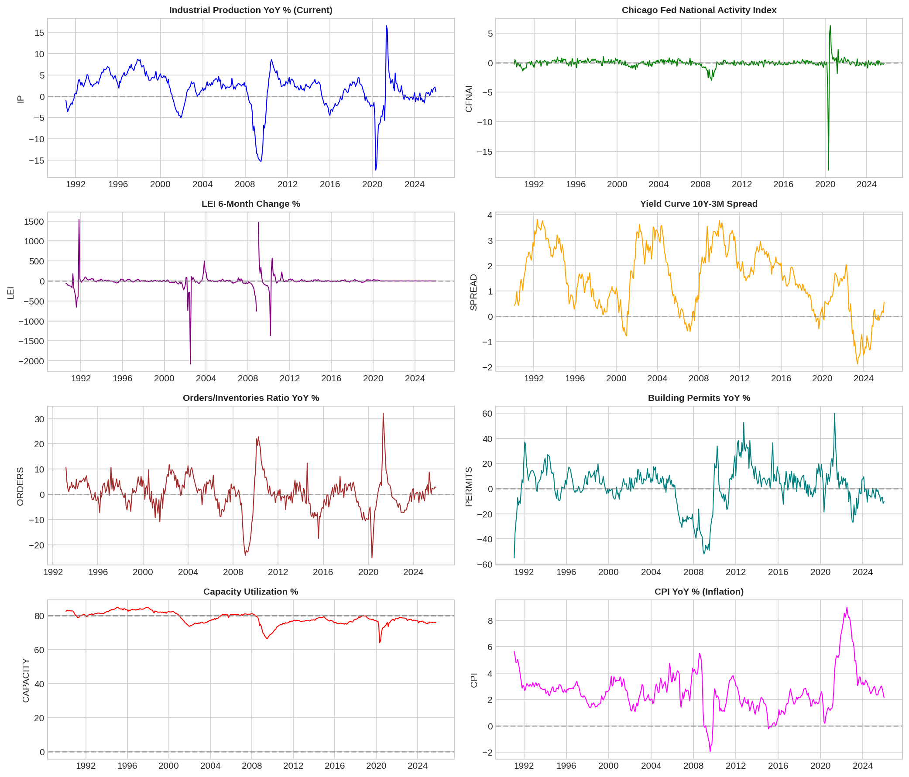
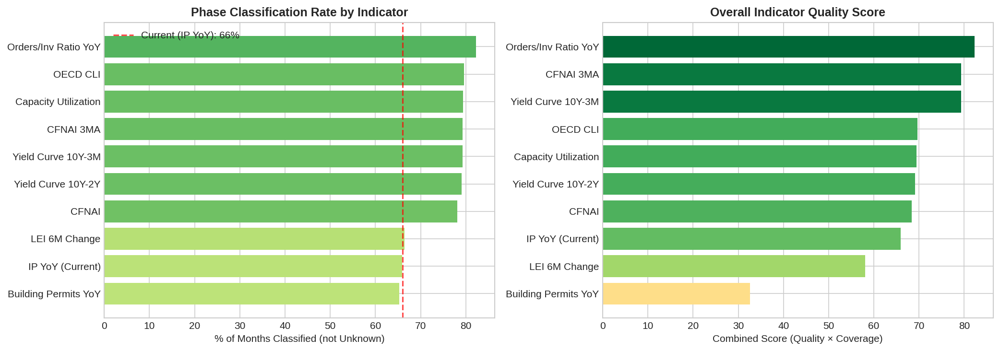
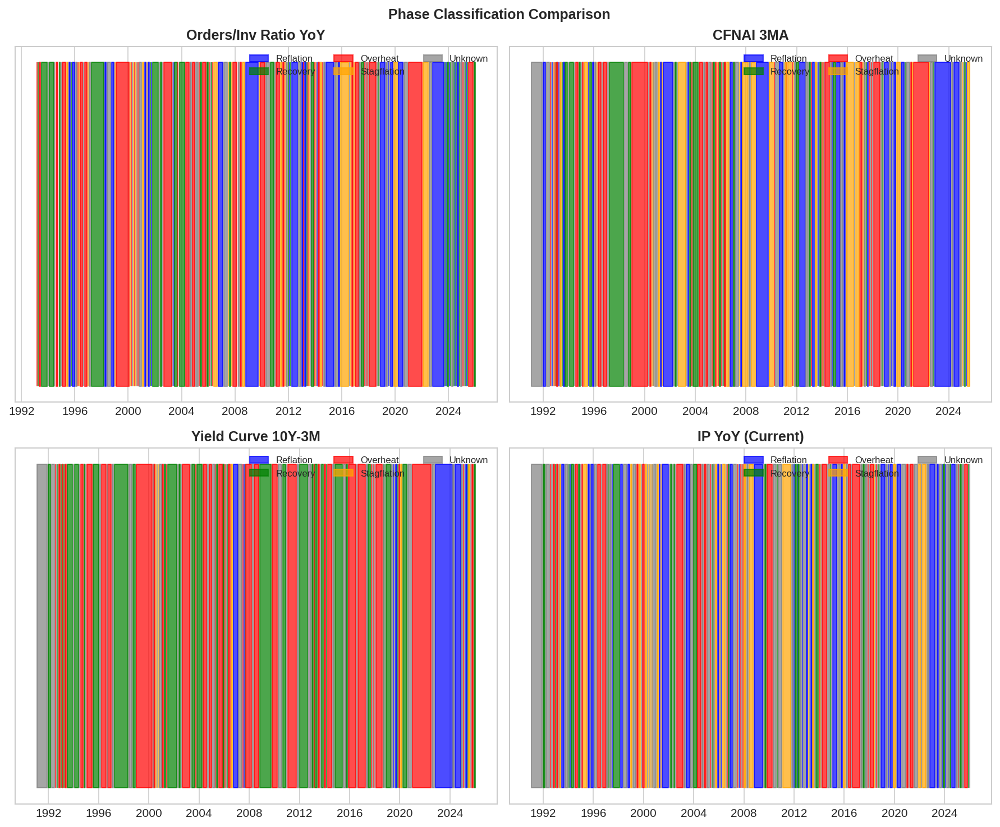

# Leading Indicators Analysis

## Objective

Identify leading indicators that can replace the lagging Output Gap / Industrial Production as the growth signal in the Investment Clock framework.

## Problem with Current Approach

**Industrial Production YoY** (the current growth indicator):
- **Lagging**: Reflects past economic activity
- **Revised**: Data gets revised, making real-time use challenging
- **Low classification rate**: Only 66% of months classified (34% "Unknown")

## Leading Indicators Tested

| Indicator | FRED Code | Description | Lead Time |
|-----------|-----------|-------------|-----------|
| **Orders/Inv Ratio YoY** | AMTMNO / AMTMTI | New Orders / Inventories ratio YoY change | 3-6 months |
| **CFNAI 3MA** | CFNAI | Chicago Fed National Activity Index (3-month MA) | 3-4 months |
| **Yield Curve 10Y-3M** | T10Y3M | Treasury spread (best recession predictor) | 12 months |
| **Yield Curve 10Y-2Y** | T10Y2Y | Treasury spread | 6-12 months |
| **OECD CLI** | USALOLITONOSTSAM | Composite Leading Indicator | 6-9 months |
| **Capacity Utilization** | TCU | Industrial capacity utilization | 0-3 months |
| **LEI 6M Change** | USSLIND | Conference Board Leading Index | 7 months |
| **Building Permits YoY** | PERMIT | Housing permits | 3-6 months |
| **IP YoY (Current)** | INDPRO | Industrial Production (benchmark) | 0 (lagging) |

## Results Summary

### Classification Rate (% of months not "Unknown")

| Indicator | Classification Rate | Improvement vs IP YoY |
|-----------|--------------------|-----------------------|
| **Orders/Inv Ratio YoY** | **82.3%** | +16.3 pp |
| OECD CLI | 79.6% | +13.6 pp |
| Capacity Utilization | 79.4% | +13.4 pp |
| CFNAI 3MA | 79.3% | +13.3 pp |
| Yield Curve 10Y-3M | 79.3% | +13.3 pp |
| Yield Curve 10Y-2Y | 79.0% | +13.0 pp |
| CFNAI | 78.1% | +12.1 pp |
| LEI 6M Change | 66.4% | +0.4 pp |
| **IP YoY (Current)** | **66.0%** | baseline |
| Building Permits YoY | 65.2% | -0.8 pp |

### Quality Score (How well phases match theoretical asset performance)

| Indicator | Quality Score | Classification Rate | **Combined Score** |
|-----------|---------------|--------------------|--------------------|
| **Orders/Inv Ratio YoY** | 100% | 82.3% | **82.3** |
| **CFNAI 3MA** | 100% | 79.3% | **79.3** |
| **Yield Curve 10Y-3M** | 100% | 79.3% | **79.3** |
| OECD CLI | 87.5% | 79.6% | 69.6 |
| Capacity Utilization | 87.5% | 79.4% | 69.5 |
| Yield Curve 10Y-2Y | 87.5% | 79.0% | 69.2 |
| CFNAI | 87.5% | 78.1% | 68.4 |
| IP YoY (Current) | 100% | 66.0% | 66.0 |
| LEI 6M Change | 87.5% | 66.4% | 58.1 |
| Building Permits YoY | 50.0% | 65.2% | 32.6 |

## Asset Performance Validation

### Stocks by Phase (theory: Recovery > Overheat > Reflation > Stagflation)

| Indicator | Overheat | Recovery | Reflation | Stagflation |
|-----------|----------|----------|-----------|-------------|
| **Orders/Inv Ratio YoY** | 0.95% | 1.29% | 1.46% | **-0.72%** |
| **CFNAI 3MA** | 1.13% | 1.59% | 1.32% | **-0.32%** |
| IP YoY (Current) | 1.15% | 1.14% | 1.26% | **-0.67%** |

✅ All top indicators correctly identify **Stagflation as worst for stocks** (negative returns)

### Oil by Phase (theory: Overheat >> others)

| Indicator | Overheat | Recovery | Reflation | Stagflation |
|-----------|----------|----------|-----------|-------------|
| **Orders/Inv Ratio YoY** | **2.38%** | 1.35% | -0.72% | 0.65% |
| **CFNAI 3MA** | **2.77%** | -0.12% | 0.25% | 1.16% |
| Capacity Utilization | **3.89%** | 0.39% | 0.13% | 1.52% |
| IP YoY (Current) | **2.52%** | -0.95% | -0.02% | -0.22% |

✅ All top indicators correctly identify **Overheat as best for commodities**

## Recommendation

### Primary Recommendation: **Orders/Inventories Ratio YoY**

**Why:**
1. **Highest combined score** (82.3) - best balance of coverage and quality
2. **True leading indicator** (3-6 month lead)
3. **Economic logic**: When new orders exceed inventory growth, production pressure builds → signals future expansion
4. **Simple threshold**: >0 = expansion, <0 = contraction

**FRED Codes:**
- New Orders: `AMTMNO` (Manufacturers' New Orders: Total Manufacturing)
- Inventories: `AMTMTI` (Manufacturers' Total Inventories)
- Formula: `(New Orders / Inventories).pct_change(12) * 100`

### Alternative Recommendations

1. **CFNAI 3MA** (Combined Score: 79.3)
   - Chicago Fed National Activity Index (3-month moving average)
   - Already centered at 0 (threshold-ready)
   - Composite of 85 indicators

2. **Yield Curve 10Y-3M** (Combined Score: 79.3)
   - Best recession predictor (12-month lead)
   - Daily data availability
   - Simple interpretation: >0 = expansion expected

### Combination Approach

Consider using multiple indicators:
```
Growth Signal = 1 if (Orders/Inv > 0 AND CFNAI_3MA > 0)
              = -1 if (Orders/Inv < 0 AND CFNAI_3MA < 0)
              = 0 otherwise
```

This could further reduce "Unknown" phases while maintaining signal quality.

## Visualizations

### Leading Indicators Time Series


### Indicator Comparison


### Phase Comparison


## Data Files

| File | Description |
|------|-------------|
| `monthly_leading_indicators.parquet` | All leading indicators monthly data |
| `indicator_comparison_results.csv` | Classification statistics by indicator |
| `indicator_quality_scores.csv` | Quality scores and rankings |
| `monthly_with_best_phases.parquet` | Monthly data with best indicator phases |

## Next Steps

1. **Implement enhanced phase classification** using Orders/Inv Ratio YoY
2. **Backtest** the new indicator vs. current approach
3. **Test combination approaches** (multiple indicators)
4. **ML enhancement**: Use these indicators as features for regime detection models

---
*Analysis Date: 2025-12-13*
