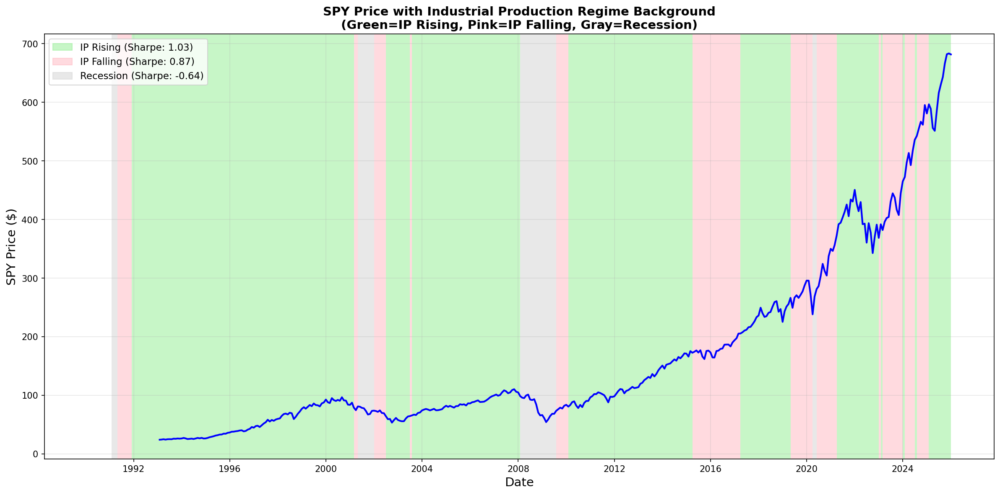
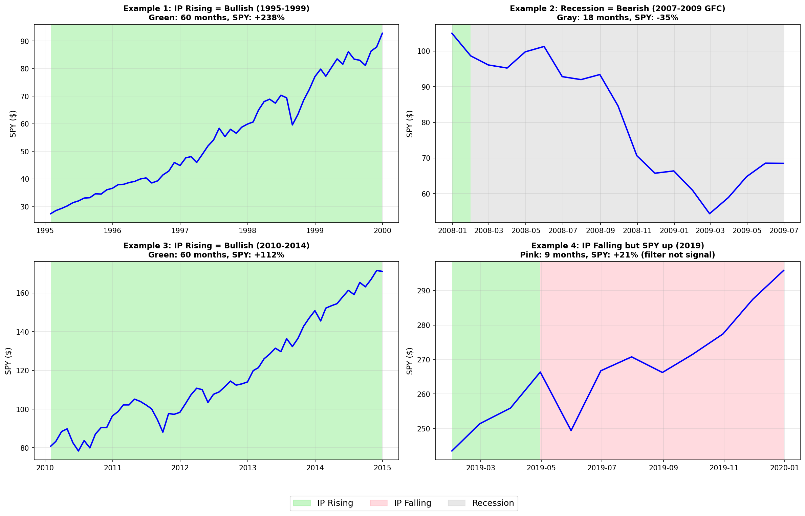

# SPY vs Industrial Production Analysis

## Overview

This analysis explores the relationship between S&P 500 (SPY) price/returns and Industrial Production (INDPRO) using the Time Series Relationship Analysis Framework: correlation analysis, lead-lag testing, Granger causality, ML predictive models, and regime analysis.

**Data Period**: January 1993 to November 2024 (383 months)

---

## Qualitative Analysis: Understanding Industrial Production

### What is the Industrial Production Index?

The Industrial Production Index (INDPRO) measures the real output of all relevant establishments located in the United States for manufacturing, mining, and electric and gas utilities. Published monthly by the Federal Reserve Board since 1919, it is one of the oldest and most closely watched economic indicators.

**Key Characteristics:**
- **Coincident Indicator**: Moves with the business cycle, not ahead of it
- **Coverage**: ~20% of the U.S. economy (manufacturing-focused)
- **Release Timing**: Mid-month, approximately 15 days after the reference month
- **Revisions**: Subject to revisions for 3-4 months after initial release

### Market Interpretation and Usage

#### Role in Recession Dating

The NBER Business Cycle Dating Committee considers Industrial Production as one of the "Big Four" recession indicators, alongside:
1. Real Personal Income (less transfers)
2. Nonfarm Payroll Employment
3. Real Personal Consumption Expenditures
4. Industrial Production

According to the [Federal Reserve's recession risk analysis](https://www.federalreserve.gov/econres/notes/feds-notes/financial-and-macroeconomic-indicators-of-recession-risk-20220621.html), these indicators are combined into coincident economic indexes to identify business cycle turning points. The [Chicago Fed's research](https://www.chicagofed.org/publications/chicago-fed-letter/2019/425) found that IP is highly sensitive and quick to react to changes in the business cycle.

#### How Investors Use Industrial Production

1. **Economic Health Barometer**: Rising IP signals economic expansion; falling IP signals contraction
2. **Capacity Utilization Context**: IP is released alongside capacity utilization, which indicates inflation pressure
3. **Sector Analysis**: Breakdown by industry provides insights into manufacturing, mining, and utilities
4. **Leading vs Coincident**: While IP itself is coincident, its rate of change can provide early warnings

#### Academic Research on IP and Stock Returns

Research has documented the relationship between industrial production and stock market returns:

- **Fama (1981)** in "Stock Returns, Real Activity, Inflation, and Money" established foundational work on the relationship between stock returns and real economic activity including industrial production ([American Economic Review](https://www.aeaweb.org/))

- **Balvers, Cosimano and McDonald (1990)** examined whether stock returns can be predicted by forecasts of industrial output, finding evidence of predictive relationships in some periods

- **Hong et al.** found that industry portfolios can lead the market by up to two months, with this ability strongly correlated with the propensity to forecast industrial production growth ([Harrison Hong - NYU Stern](https://pages.stern.nyu.edu/~rengle/Harrison%20Hong.pdf))

- **Stock and Watson (1998)** reported that the relationship between stock returns and production growth has not remained stable over time, cautioning against purely mechanical trading rules

- Research on [20 international markets](https://www.researchgate.net/publication/319894501_Stock_Market_Activities_and_Industrial_Production_Growth_Evidence_from_20_International_Markets) found unidirectional causality running from stock returns to industrial production growth, suggesting stocks lead production rather than vice versa

#### Recent Public Analysis

The [Advisor Perspectives "Big Four" series](https://www.advisorperspectives.com/dshort/updates/2025/09/16/recession-indicators-industrial-production-august-2025) provides ongoing tracking of industrial production as a recession indicator:

> "In the past 6 recessions, industrial production fell by an average of 4.6 percent... The manufacturing sector makes up less than 20% of the economy, but this indicator is closely watched as it is highly sensitive and quick to react to changes in the business cycle."

The [Conference Board's Leading Economic Index](https://www.conference-board.org/topics/us-leading-indicators/) incorporates industrial production components, noting that up to nine months in advance, their index "does the best at signaling coming recessions and expansions."

### Key Insights from Literature

| Finding | Source | Implication |
|---------|--------|-------------|
| IP is coincident, not leading | NBER, Fed | Cannot predict stock returns directly |
| Stock returns lead IP | International research | Markets anticipate production changes |
| Relationship unstable over time | Stock & Watson | Historical patterns may not persist |
| IP reacts quickly to business cycle | Chicago Fed | Useful for confirming regime changes |
| "Big Four" indicator for recessions | Advisor Perspectives | Critical for identifying economic downturns |

### Limitations as a Stock Market Indicator

1. **Coincident Nature**: By the time IP declines, stocks have often already priced in the weakness
2. **Sector Concentration**: Manufacturing is <20% of GDP; services dominate the modern economy
3. **Data Revisions**: Initial releases are often revised, creating noise for trading decisions
4. **Global Supply Chains**: U.S. production increasingly disconnected from U.S. corporate profits

---

## Key Findings Summary

### 1. Strong Positive Level Relationship
- **Correlation: +0.563** between SPY price and Industrial Production level
- Both series trend upward over time (economic growth)
- YoY changes also positively correlated (+0.532)

### 2. Contemporaneous Relationship in Changes
- IP changes have **positive correlation** with SPY returns:
  - MoM: +0.188
  - QoQ: +0.299
  - YoY: +0.532 (strongest)
- Interpretation: When industrial production rises, SPY tends to rise

### 3. Limited Predictive Power
- **Granger Causality**: IP_MoM shows significance at lags 5-6 (p < 0.05)
- **ML Models**: Negative R² values indicate IP cannot reliably predict SPY returns
- Best performing model (Lasso, 1-month horizon): R² = -0.08
- The relationship is primarily **contemporaneous**, not predictive

### 4. Regime-Based Insights (Most Valuable Finding)

| Regime | Mean Monthly Return | Sharpe Ratio | Win Rate |
|--------|---------------------|--------------|----------|
| **IP Rising** | +0.98% | **1.03** | 64.6% |
| IP Falling | +0.83% | 0.87 | 61.6% |
| **Recession** | -1.36% | -0.64 | 39.3% |

**Key Insight**: SPY performs better when Industrial Production is rising, though the difference is not statistically significant (p=0.77). The recession indicator provides the clearest regime differentiation.

## Detailed Analysis

### Correlation Matrix

```
                     SPY    IP_Level    IP_MoM    IP_QoQ    IP_YoY   SPY_MoM  SPY_QoQ  SPY_YoY
SPY                1.000       0.563     0.057     0.073     0.056     0.069    0.106    0.175
Industrial_Prod    0.563       1.000     0.221     0.323     0.464    -0.033   -0.012    0.089
IP_MoM             0.057       0.221     1.000     0.675     0.431     0.188    0.184    0.101
IP_QoQ             0.073       0.323     0.675     1.000     0.692     0.199    0.299    0.205
IP_YoY             0.056       0.464     0.431     0.692     1.000     0.180    0.346    0.532
```

**Observations**:
- Strong positive correlation between SPY price and IP level (+0.563)
- Positive correlation between IP changes and SPY returns
- IP_YoY has strongest relationship with SPY_YoY (+0.532)

### Lead-Lag Analysis

Tested lags from -12 to +12 months:

| Relationship | Optimal Lag | Correlation | Interpretation |
|--------------|-------------|-------------|----------------|
| IP_YoY vs SPY_YoY | 0 | +0.532 | Contemporaneous |
| IP_QoQ vs SPY_QoQ | 0 | +0.299 | Contemporaneous |
| IP_MoM vs SPY_MoM | 0 | +0.188 | Contemporaneous |

**Conclusion**: Peak correlation occurs at lag 0 for all timeframes, indicating a **contemporaneous** rather than predictive relationship. IP and SPY move together in response to the same economic forces.

### Granger Causality Tests

Tested if IP Granger-causes SPY returns at lags 1-6 months:

| Feature | Best Lag | F-statistic | P-value | Significant? |
|---------|----------|-------------|---------|--------------|
| IP_MoM | 5-6 | 2.4-2.6 | 0.03-0.04 | **Yes** |
| IP_QoQ | 1-6 | ~1.5 | >0.10 | No |
| IP_YoY | 1-6 | ~1.2 | >0.25 | No |

**Conclusion**: IP_MoM shows marginal Granger causality at longer lags (5-6 months), but the effect is weak and does not translate to practical predictive power.

### ML Predictive Model Results

Models trained to predict 1-month and 3-month forward SPY returns using lagged IP features:

| Horizon | Model | CV R² | RMSE | MAE |
|---------|-------|-------|------|-----|
| 1m | Linear Regression | -0.42 | 5.10 | 3.82 |
| 1m | Ridge | -0.22 | 4.73 | 3.58 |
| 1m | Lasso | -0.08 | 4.44 | 3.42 |
| 1m | Random Forest | -0.18 | 4.65 | 3.55 |
| 1m | Gradient Boosting | -0.35 | 4.97 | 3.91 |

**Top Features (Random Forest)**:
1. IP_YoY_lag12: 12.1%
2. IP_QoQ_lag6: 10.5%
3. IP_YoY_lag6: 9.8%
4. IP_MoM_lag3: 8.9%
5. IP_QoQ_lag12: 8.2%

**Conclusion**: All models have **negative R²**, meaning IP features perform worse than simply predicting the mean return. Despite the Granger causality result, there is no exploitable predictive relationship.

### Regime Analysis

SPY monthly returns segmented by Industrial Production regimes:

#### By Direction (Rising vs Falling)
- **IP Rising** (YoY > 0): Mean return +0.98%, Sharpe 1.03, Win Rate 64.6%
- **IP Falling** (YoY < 0): Mean return +0.83%, Sharpe 0.87, Win Rate 61.6%
- **Difference**: +0.15% per month, ~1.8% annualized (not statistically significant, p=0.77)

#### With Recession Indicator
- **Expansion + IP Rising**: Mean +1.05%, Sharpe 1.10 (best regime)
- **Expansion + IP Falling**: Mean +1.12%, Sharpe 1.02
- **Recession**: Mean -1.36%, Sharpe -0.64 (worst regime)

**Note**: The difference between IP Rising and IP Falling regimes is NOT statistically significant. The recession indicator provides clearer regime differentiation.

## Visualizations

### Full Timeline with Regime Background



*Green = IP Rising (YoY > 0), Pink = IP Falling (YoY < 0), Gray = Recession*

### Validated Examples



## Validated Visual Examples

### Example 1: 1995-1999 Bull Market (IP Rising)
- **Period**: January 1995 - December 1999
- **Regime**: IP Rising 100% of months
- **SPY Performance**: +238%
- **Validation**: Green background dominates, strong upward price trend

### Example 2: 2007-2009 Global Financial Crisis (Recession)
- **Period**: December 2007 - June 2009
- **Regime**: Recession 95% of months
- **SPY Performance**: -35%
- **Validation**: Gray background dominates, severe drawdown

### Example 3: 2010-2014 Recovery (IP Rising)
- **Period**: January 2010 - December 2014
- **Regime**: IP Rising 100% of months
- **SPY Performance**: +112%
- **Validation**: Green background dominates, steady recovery

### Example 4: 2019 (IP Falling but Positive Returns)
- **Period**: Full year 2019
- **Regime**: IP Falling 75% of months
- **SPY Performance**: +22%
- **Validation**: Pink background dominates, but positive returns
- **Interpretation**: IP regime is a **filter**, not a timing signal

## Economic Interpretation

### Why the Positive Relationship?

The positive correlation between IP and SPY makes economic sense:

1. **Industrial Production as Growth Proxy**
   - IP measures real output of manufacturing, mining, and utilities
   - Rising IP indicates economic expansion
   - Economic expansion is bullish for corporate earnings and stocks

2. **Coincident Indicator**
   - IP is a coincident economic indicator
   - Moves with the business cycle, not ahead of it
   - Both IP and SPY respond to the same underlying economic forces

3. **Recession Amplification**
   - During recessions, IP falls sharply
   - Stocks also fall during recessions
   - The recession regime shows the strongest differentiation

### Why Limited Predictive Power?

Despite the correlation, IP lacks predictive power because:

1. **Coincident, Not Leading**: IP moves with the economy, not ahead
2. **Data Lag**: IP is released with ~2 week delay
3. **Markets are Forward-Looking**: Stock prices incorporate expectations, not current data
4. **Weak Effect Size**: The regime difference (+0.15%/month) is too small to trade profitably

## Comparison with RETAILIRSA Analysis

| Metric | Industrial Production | RETAILIRSA |
|--------|----------------------|------------|
| Level Correlation | +0.563 | -0.767 |
| Direction | Same direction | Opposite direction |
| Best Regime Sharpe | 1.03 (IP Rising) | 1.03 (Low Inv/Sales) |
| Worst Regime Sharpe | -0.64 (Recession) | -0.64 (Recession) |
| Regime Diff Significant? | No (p=0.77) | Yes (~0.05) |
| Granger Causality | IP_MoM at lag 5-6 | None |
| ML Predictive Power | None (R² < 0) | None (R² < 0) |

**Key Differences**:
- IP moves WITH the market (positive correlation)
- RETAILIRSA moves AGAINST the market (negative correlation)
- RETAILIRSA shows slightly stronger regime differentiation
- Both indicators' most useful signal is the **recession indicator**

## Practical Applications

### For Investment Clock Integration

Industrial Production is useful as:

1. **Economic Regime Confirmation**: Rising IP confirms expansion phase
2. **Recession Detection**: Falling IP often accompanies recessions
3. **Filter, Not Signal**: Use IP direction as context, not timing

### Trading Implications

**Simple Rule**: Favor stocks when IP YoY > 0 (rising production)
- Historical advantage: +1.8% annualized (not significant)
- Sharpe improvement: 1.03 vs 0.87
- **Caveat**: Effect is weak and not statistically significant

**Better Approach**: Use recession indicator
- Non-recession periods: Sharpe ~1.0
- Recession periods: Sharpe -0.64
- The recession signal is much stronger than IP direction alone

## Files Created

| File | Description |
|------|-------------|
| `data/spy_ip_analysis.parquet` | SPY + IP + derivatives dataset |
| `data/spy_ip_regime_background.png` | Full timeline with regime colors |
| `data/spy_ip_regime_examples.png` | 4 validated example plots |
| `docs/analysis_reports/spy_industrial_production_analysis.md` | This document |

## Conclusion

**Industrial Production does not predict SPY returns**, but provides valuable economic context:

1. **IP and SPY are positively correlated** - both respond to economic growth
2. **The relationship is contemporaneous**, not leading
3. **IP Rising regime has slightly better Sharpe** (1.03 vs 0.87) but the difference is not statistically significant
4. **Recession indicator is more useful** than IP direction alone
5. **Use IP as a filter**, not a signal - confirms economic regime but doesn't predict returns

The most actionable insight: **Avoid equity exposure during recessions**. The IP direction effect (+1.8% annualized) is too weak to trade on its own.
