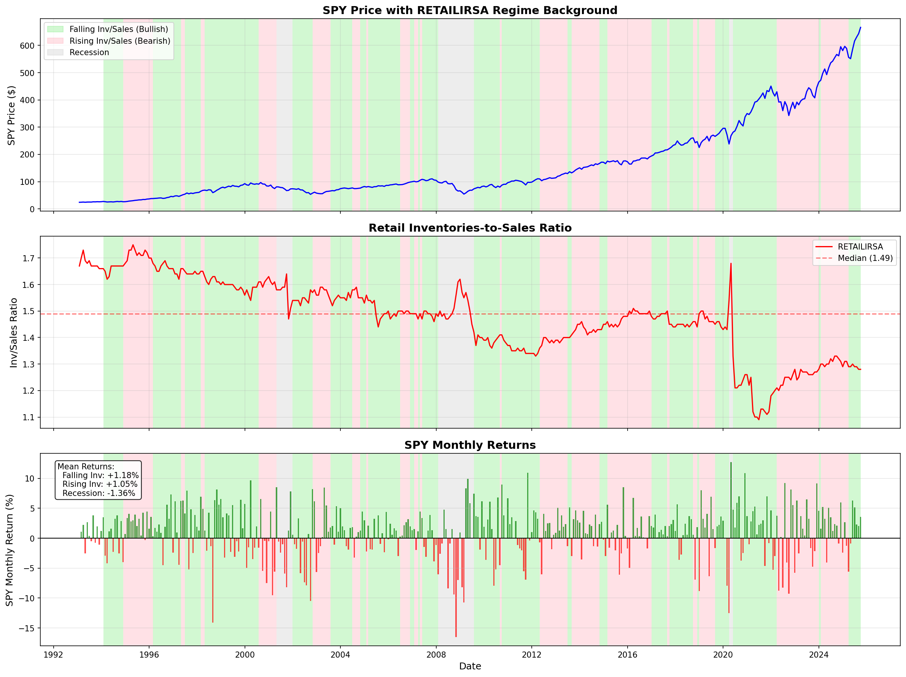
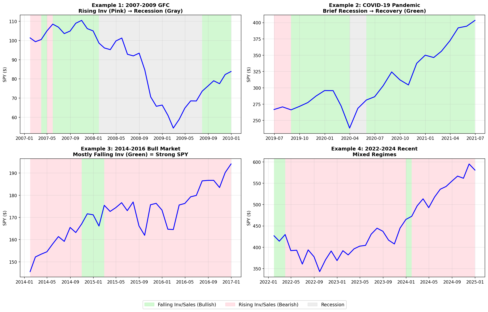
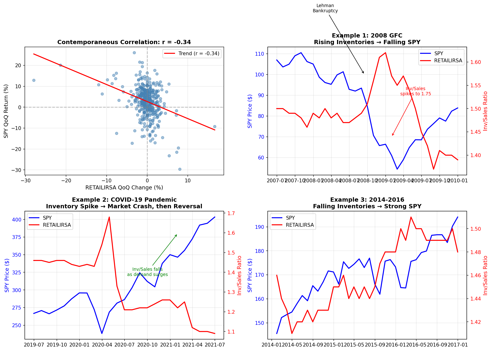
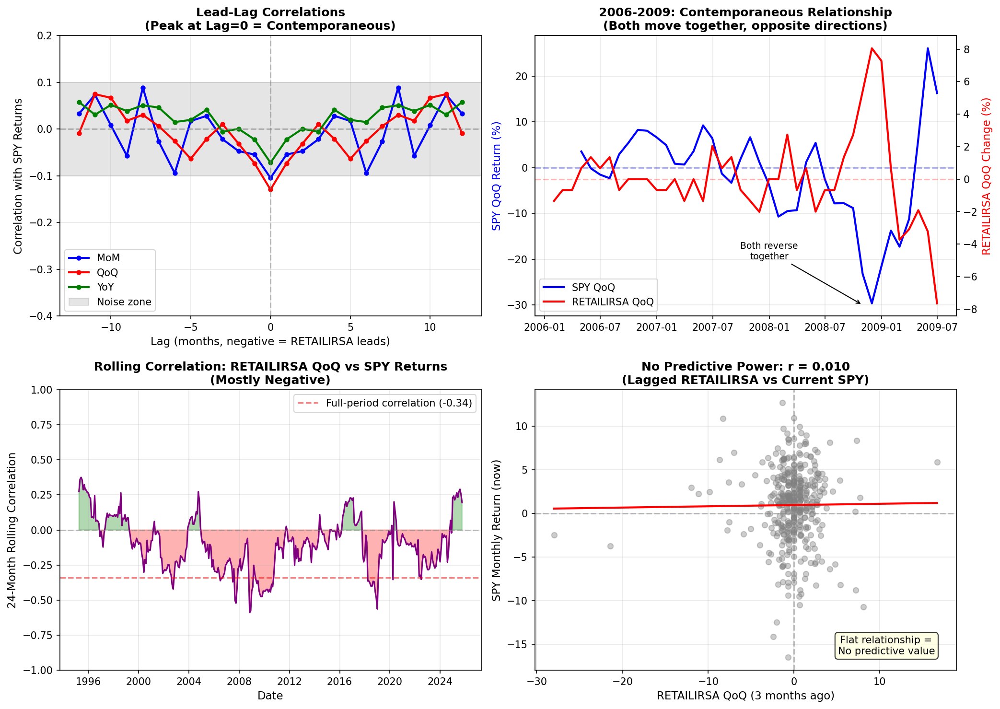

# SPY vs Retail Inventories-to-Sales Ratio Analysis

## Overview

This analysis explores the relationship between S&P 500 (SPY) price/returns and the Retail Inventories-to-Sales Ratio (RETAILIRSA) using correlation analysis, lead-lag testing, Granger causality, ML predictive models, and regime analysis.

**Data Period**: January 1993 to September 2025 (393 months)

---

## Qualitative Analysis: Understanding RETAILIRSA

### What is the Retail Inventories-to-Sales Ratio?

The Retail Inventories-to-Sales Ratio (RETAILIRSA) measures the relationship between end-of-month inventory values and monthly sales for retail businesses. Published monthly by the U.S. Census Bureau and available through [FRED](https://fred.stlouisfed.org/series/RETAILIRSA), it indicates how many months of inventory retailers are holding relative to their sales rate.

**Key Characteristics:**
- **Formula**: Inventory Level / Net Sales
- **Interpretation**: A ratio of 1.5 means retailers hold 1.5 months of inventory relative to sales
- **Historical Range**: Record high of 1.75 (April 1995), record low of 1.09 (June 2021)
- **Current Median**: ~1.49
- **Release Timing**: Mid-month, approximately 6 weeks after the reference month

### Market Interpretation and Usage

#### Economic Signal Interpretation

According to [FRED data analysis](https://fred.stlouisfed.org/series/RETAILIRSA) and [TradingView](https://www.tradingview.com/symbols/FRED-RETAILIRSA/):

| Ratio Level | Interpretation |
|-------------|----------------|
| **Rising** | Retailers overstocked; demand weakening; potential economic slowdown |
| **Falling** | Strong consumer demand; supply constraints; economic strength |
| **High (>1.5)** | Excess inventory; potential markdowns; margin pressure |
| **Low (<1.3)** | Lean inventory; supply chain stress or strong demand |

#### The Bullwhip Effect Connection

The ratio is closely tied to the [bullwhip effect](https://sloanreview.mit.edu/article/the-bullwhip-effect-in-supply-chains/) - a supply chain phenomenon documented by MIT Sloan where small changes in consumer demand create amplified swings upstream:

> "When businesses notice signs of an impending recession, such as rising inflation, interest rate hikes, and a slowdown in consumer spending, the bullwhip effect may be close behind." - [TrueCommerce](https://www.truecommerce.com/blog/how-recessions-create-a-bullwhip-effect/)

The [Supply Chain Management Review](https://www.scmr.com/article/current-inventory-dynamics-arent-the-bullwhip-effect) notes that the "inventory accelerator" concept explains why "when demand decreases, the decline in orders is larger than the decline in sales as firms attempt to reduce their inventory levels."

#### Role as a Recession Indicator

[NetSuite's recession indicators guide](https://www.netsuite.com/portal/resource/articles/business-strategy/recession-indicators.shtml) identifies inventory levels as a relatively consistent recession signal:

> "In the past three recessions, Total Business Inventories reached 12-, 24-, and 36-month highs within 6 months of the recession's official start."

The self-reinforcing cycle is clear: reduced consumer confidence → lower spending → rising inventories → production cuts → job losses → further confidence decline.

#### Recent Market Events

**2020-2021 Supply Chain Crisis**: The record low of 1.09 in June 2021 reflected unprecedented supply chain disruptions combined with stimulus-fueled demand. [CNBC reported](https://www.cnbc.com/2022/05/24/what-retail-inventory-misses-markdowns-say-about-fighting-inflation.html) on how retail inventory misses and subsequent markdowns signaled the market's inflation dynamics.

**2022-2023 Inventory Correction**: As documented by [Tilley Distribution](https://www.tilleydistribution.com/insights/inventory-levels-economic-indicator-or-not/), retailers faced an inventory glut after over-ordering during supply shortages, leading to aggressive discounting and margin pressure.

### Key Insights from Literature

| Finding | Source | Implication |
|---------|--------|-------------|
| Rising inventories precede recessions | NetSuite, FocusEconomics | Early warning signal |
| Ratio spikes within 6 months of recession | Historical analysis | Useful for timing |
| Bullwhip effect amplifies small demand changes | MIT Sloan | Explains volatility |
| Record low in 2021 was anomaly | FRED historical data | Context matters |
| Consumer spending drives inventory cycles | Morningstar | Demand is key driver |

#### Academic and Professional Research

- [Rosenberg Research](https://www.rosenbergresearch.com/2024/04/22/unveiling-recession-leading-indicators/) identifies inventory dynamics as one of their key recession-leading indicators

- [Advisor Perspectives](https://www.advisorperspectives.com/dshort/updates/2025/11/25/the-big-four-recession-indicators) tracks inventory-related metrics as part of recession monitoring

- [FocusEconomics](https://www.focus-economics.com/blog/economic-indicators-for-recession/) notes that "short-term changes in business inventories can indicate shifts in production and demand and forecast market upturns or downswings"

### Limitations as a Stock Market Indicator

1. **Publication Lag**: Data released ~6 weeks after month-end; markets have moved
2. **Sector-Specific**: Retail represents portion of economy; doesn't capture services
3. **Supply Chain Complexity**: Global supply chains complicate interpretation
4. **Structural Changes**: E-commerce and just-in-time practices have lowered "normal" ratios
5. **COVID Distortions**: 2020-2022 created unprecedented volatility in the series

---

## Key Findings Summary

### 1. Strong Inverse Level Relationship
- **Correlation: -0.767** between SPY price and RETAILIRSA level
- As SPY rises over time, the Inventories-to-Sales ratio has fallen (supply chain efficiency)
- This is a **spurious correlation** due to opposite secular trends, not a causal relationship

### 2. Weak Contemporaneous Relationship in Changes
- RETAILIRSA changes have **weak negative correlation** with SPY returns:
  - MoM: -0.105
  - QoQ: -0.129 (strongest)
  - YoY: -0.072
- Interpretation: When retailers build inventory faster, SPY tends to underperform slightly

### 3. No Predictive Power
- **Granger Causality**: No significant causality in either direction (all p > 0.05)
- **ML Models**: Negative R² values indicate RETAILIRSA cannot predict SPY returns
- Best performing model (Lasso, 1-month horizon): R² = -0.18 (worse than naive mean)

### 4. Regime-Based Insights (Most Valuable Finding)

| Regime | Mean Monthly Return | Sharpe Ratio | Win Rate |
|--------|---------------------|--------------|----------|
| **Low Inv/Sales** | +1.14% | **1.03** | 68.2% |
| High Inv/Sales | +0.70% | 0.51 | 61.1% |
| **Falling Inv/Sales** | +1.09% | **0.98** | 64.9% |
| Rising Inv/Sales | +0.72% | 0.52 | 65.2% |
| **Recession** | -1.36% | -0.64 | 39.3% |

**Key Insight**: SPY performs significantly better when:
- Inventories-to-Sales ratio is **low** (efficient supply chains)
- Inventories-to-Sales ratio is **falling** (improving efficiency)

## Detailed Analysis

### Correlation Matrix

```
                          SPY    RETAILIRSA   MoM     QoQ     YoY   SPY_MoM  SPY_QoQ  SPY_YoY
SPY                     1.000       -0.767  0.007   0.012   0.006    0.069    0.106    0.175
Retail_Inv_Sales_Ratio -0.767        1.000  0.102   0.149   0.240   -0.033   -0.105   -0.118
RETAILIRSA_MoM          0.007        0.102  1.000   0.537   0.315   -0.105   -0.189   -0.066
RETAILIRSA_QoQ          0.012        0.149  0.537   1.000   0.531   -0.129   -0.340   -0.113
RETAILIRSA_YoY          0.006        0.240  0.315   0.531   1.000   -0.072   -0.264   -0.355
```

**Observations**:
- Strong negative correlation between SPY price and RETAILIRSA level (-0.767)
- Weak negative correlation between RETAILIRSA changes and SPY returns
- RETAILIRSA_QoQ has strongest relationship with SPY_QoQ (-0.340)

### Lead-Lag Analysis

Tested lags from -12 to +12 months:

| Relationship | Lag | Correlation | P-value | Interpretation |
|--------------|-----|-------------|---------|----------------|
| RETAILIRSA_QoQ_Dir | 0 | -0.138 | 0.006 | Contemporaneous |
| RETAILIRSA_QoQ | 0 | -0.129 | 0.011 | Contemporaneous |
| RETAILIRSA_MoM | 0 | -0.105 | 0.039 | Contemporaneous |

**Conclusion**: The relationship is primarily **contemporaneous**, not predictive. No significant lead-lag relationships suggest RETAILIRSA doesn't predict future SPY returns.

### Granger Causality Tests

Tested if RETAILIRSA Granger-causes SPY returns at lags 1-6 months:

| Feature | Best Lag | F-statistic | P-value | Significant? |
|---------|----------|-------------|---------|--------------|
| RETAILIRSA_MoM | 2 | 1.619 | 0.199 | No |
| RETAILIRSA_QoQ | 1 | 2.101 | 0.148 | No |
| RETAILIRSA_YoY | 4 | 1.293 | 0.272 | No |

**Conclusion**: RETAILIRSA does **not** Granger-cause SPY returns at any lag tested.

### ML Predictive Model Results

Models trained to predict 1-month and 3-month forward SPY returns using lagged RETAILIRSA features:

| Horizon | Model | CV R² | RMSE | MAE |
|---------|-------|-------|------|-----|
| 1m | Linear Regression | -0.54 | 5.25 | 3.88 |
| 1m | Ridge | -0.31 | 4.88 | 3.69 |
| 1m | Lasso | -0.18 | 4.64 | 3.50 |
| 1m | Random Forest | -0.25 | 4.79 | 3.67 |
| 1m | Gradient Boosting | -0.50 | 5.23 | 4.08 |

**Top Features (Random Forest)**:
1. RETAILIRSA_MoM_lag6: 11.2%
2. RETAILIRSA_QoQ_lag3: 9.3%
3. RETAILIRSA_YoY_lag6: 8.8%
4. RETAILIRSA_YoY_lag1: 8.7%
5. RETAILIRSA_QoQ_lag12: 8.5%

**Conclusion**: All models have **negative R²**, meaning RETAILIRSA features perform worse than simply predicting the mean return. There is no exploitable predictive relationship.

### Regime Analysis

SPY monthly returns segmented by RETAILIRSA regimes:

#### By Level (High vs Low)
- **Low Inv/Sales** (ratio < median 1.49): Mean return +1.14%, Sharpe 1.03
- **High Inv/Sales** (ratio > median 1.49): Mean return +0.70%, Sharpe 0.51
- **Difference**: +0.44% per month, ~5.3% annualized

#### By Direction (Rising vs Falling)
- **Falling Inv/Sales** (YoY < 0): Mean return +1.09%, Sharpe 0.98
- **Rising Inv/Sales** (YoY > 0): Mean return +0.72%, Sharpe 0.52
- **Difference**: +0.37% per month, ~4.5% annualized

#### Combined with Recession Indicator
- **Expansion + Falling**: Mean +1.16%, Sharpe 1.06 (best regime)
- **Expansion + Rising**: Mean +1.05%, Sharpe 0.89
- **Recession**: Mean -1.36%, Sharpe -0.64 (worst regime)

## Visualizations

### Full Timeline with Regime Background



*Green = Falling Inventories (YoY < 0), Pink = Rising Inventories (YoY > 0), Gray = Recession*

### Validated Examples



### Correlation Evidence



### Lead-Lag Analysis



## Economic Interpretation

### Why the Inverse Relationship?

The negative correlation between RETAILIRSA changes and SPY returns makes economic sense:

1. **Rising Inventories = Demand Weakness**
   - When retailers build inventory (ratio rising), it often signals weakening consumer demand
   - Products aren't selling as expected, leading to inventory buildup
   - This is bearish for stocks

2. **Falling Inventories = Demand Strength**
   - When inventory-to-sales falls, retailers are selling through inventory faster
   - Indicates strong consumer demand
   - This is bullish for stocks

3. **Supply Chain Efficiency**
   - The secular decline in RETAILIRSA (from 1.75 to 1.28) reflects just-in-time inventory management
   - This structural improvement has coincided with the long-term bull market

### Why No Predictive Power?

Despite the contemporaneous correlation, RETAILIRSA lacks predictive power because:

1. **Data is Monthly and Lagged**: RETAILIRSA is released with a 6-week delay
2. **Markets are Efficient**: The information is priced in by release time
3. **Relationship is Weak**: Even contemporaneous correlation is only -0.13
4. **Many Other Factors**: Stock returns are driven by many variables beyond retail inventories

## Practical Applications

### For Investment Clock Integration

While RETAILIRSA cannot predict SPY returns directly, it can be useful as:

1. **Economic Regime Confirmation**: Rising RETAILIRSA often precedes or coincides with economic slowdowns
2. **Risk Indicator**: High RETAILIRSA levels (>1.5) have historically been associated with lower SPY returns
3. **Recession Warning**: Rapidly rising RETAILIRSA can signal demand destruction

### Trading Rules (Based on Regime Analysis)

**Simple Rule**: Favor stocks when RETAILIRSA YoY < 0 (falling inventories)
- Historical advantage: +4.5% annualized over rising periods
- Win rate: 65% vs 65% (similar)
- Sharpe improvement: 0.98 vs 0.52

**Caution**: This is a filter, not a timing signal. Use with other indicators.

## Files Created

| File | Description |
|------|-------------|
| `src/ml/retail_spy_analysis/__init__.py` | Package initialization |
| `src/ml/retail_spy_analysis/relationship_analysis.py` | Analysis functions |
| `data/spy_retailirsa_regime_background.png` | Full timeline with regime colors |
| `data/spy_retailirsa_regime_examples.png` | Validated example plots |
| `data/spy_retailirsa_correlation.png` | Correlation scatter plot |
| `data/spy_retailirsa_leadlag.png` | Lead-lag analysis plot |
| `docs/analysis_reports/spy_retailirsa_analysis.md` | This document |

## Conclusion

**RETAILIRSA does not predict SPY returns**, but it provides valuable regime context:

1. **Low/Falling inventory ratios** are associated with better SPY performance
2. **The relationship is contemporaneous**, not leading
3. **Use as a filter**, not a signal - combine with other indicators
4. **Recession indicator** adds significant value to the regime analysis

The most actionable insight: Favor equity exposure when RETAILIRSA is falling (YoY < 0) and avoid during recessions.
