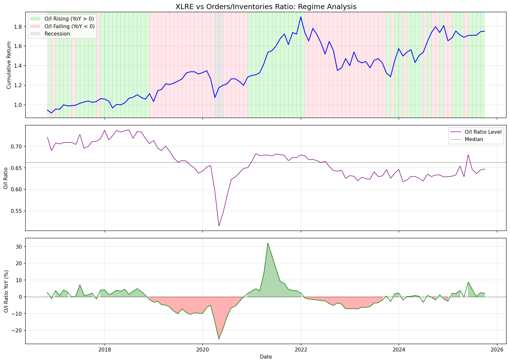
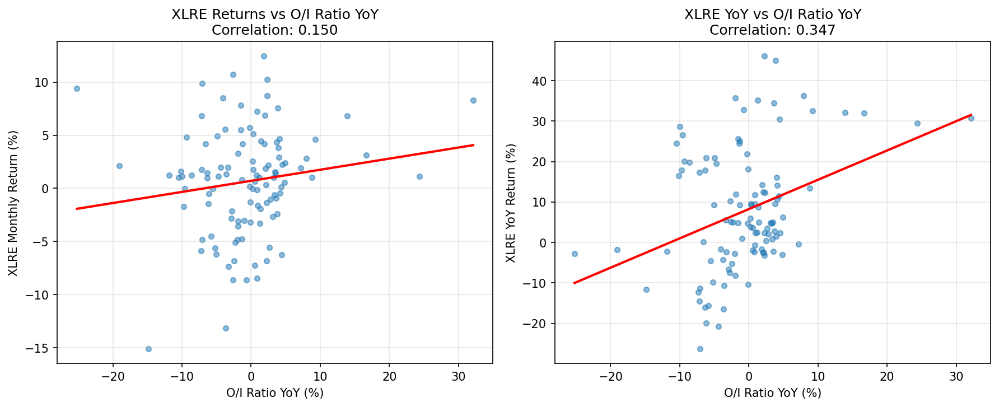
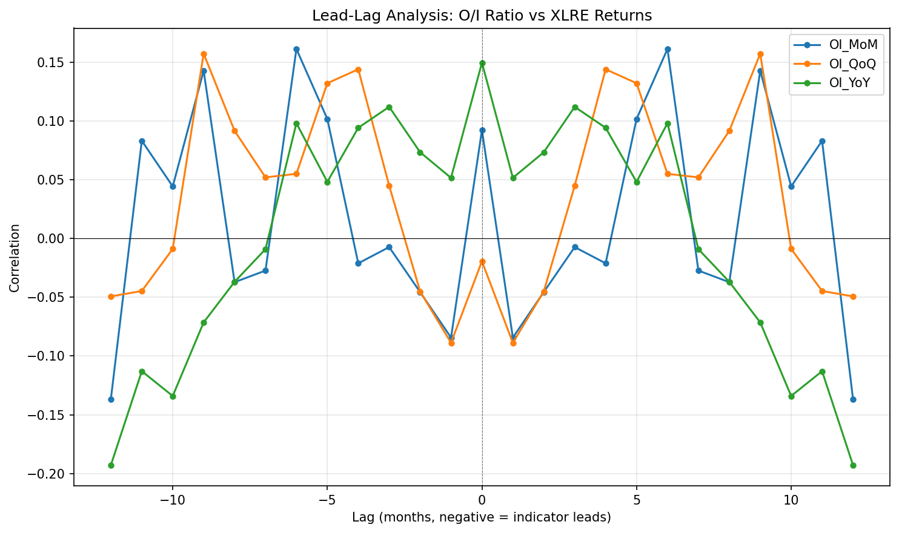
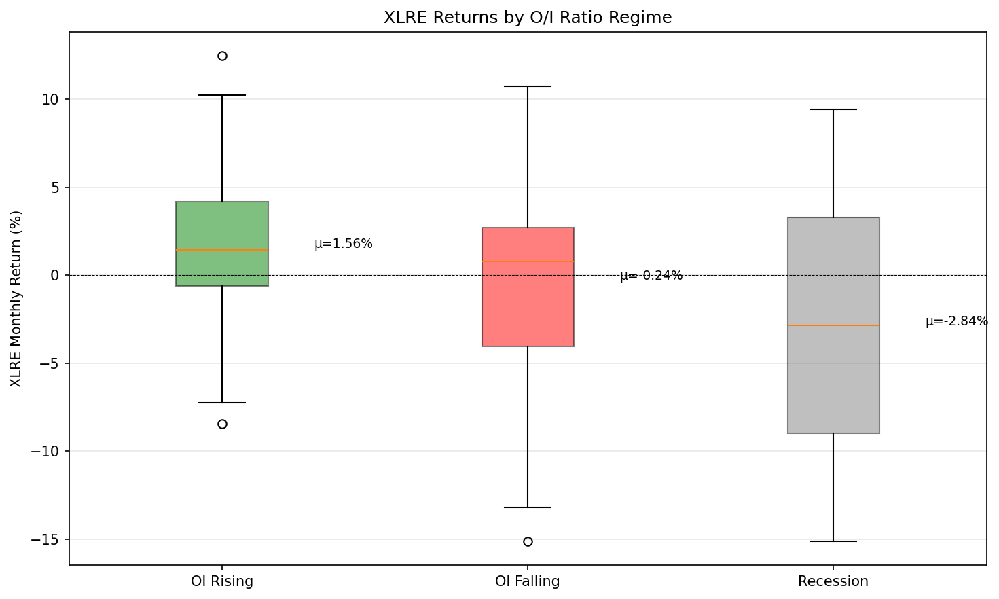
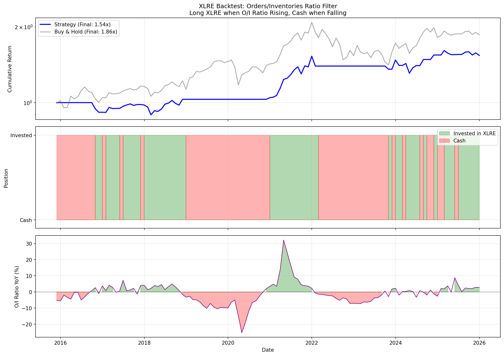

# XLRE vs Orders/Inventories Ratio Analysis

## Overview

This analysis explores the relationship between the Real Estate Select Sector SPDR Fund (XLRE) and the Manufacturing Orders/Inventories Ratio using the Time Series Relationship Analysis Framework: correlation analysis, lead-lag testing, Granger causality, ML predictive models, and regime analysis.

**Data Period**: October 2016 to September 2025 (108 months)

---

## Qualitative Analysis: Understanding the Orders/Inventories Ratio

### What is the Orders/Inventories Ratio?

The Orders/Inventories Ratio measures the relationship between new manufacturing orders and existing inventory levels. It is derived from the Census Bureau's [Manufacturers' Shipments, Inventories, and Orders (M3) survey](https://www.census.gov/economic-indicators/), one of the key economic indicators tracked by the U.S. Department of Commerce.

**Key Characteristics:**
- **Formula**: New Orders / Total Inventories
- **Interpretation**: A rising ratio indicates demand is outpacing inventory (economic strength); a falling ratio indicates inventory accumulation relative to orders (potential slowdown)
- **Release Timing**: Published monthly by the Census Bureau
- **Leading Property**: Changes in the ratio often precede broader economic shifts

### Market Interpretation and Usage

#### Economic Signal Interpretation

| Ratio Direction | Interpretation |
|-----------------|----------------|
| **Rising** | Strong demand, lean inventories, economic expansion |
| **Falling** | Weakening demand, inventory buildup, potential contraction |
| **High Level** | Manufacturing capacity stretched, potential supply constraints |
| **Low Level** | Excess inventory, demand weakness |

#### Role as a Leading Indicator

According to [Advisor Perspectives](https://www.advisorperspectives.com/commentaries/2024/12/18/economic-indicators-trajectory-earnings), the Orders/Inventories ratio is closely watched as part of the manufacturing sector's leading indicators:

> "Inventory levels are viewed as one of several key leading economic indicators. High inventory levels signal a degree of short-term and long-term market confidence."

The [Conference Board's Leading Economic Index (LEI)](https://www.conference-board.org/topics/us-leading-indicators/) incorporates manufacturing orders data, noting that up to nine months in advance, their index "does the best at signaling coming recessions and expansions."

#### Recession Indicator Properties

[Rosenberg Research](https://www.rosenbergresearch.com/2024/04/22/unveiling-recession-leading-indicators/) identifies the orders-to-inventories dynamic as one of their key recession-leading indicators. Historical patterns show:

> "In the past three recessions, Total Business Inventories reached 12-, 24-, and 36-month highs within 6 months of the recession's official start."

### Why Real Estate is Sensitive to Manufacturing Indicators

Real Estate (XLRE) shows strong sensitivity to manufacturing indicators for several interconnected reasons:

#### 1. Interest Rate Sensitivity

According to [Invesco's REIT research](https://www.invesco.com/us/en/insights/why-reits-may-benefit-rate-cutting-environment.html):

> "Lower rates reduce borrowing costs, boost valuations, and increase investor demand for yield, helping create a favorable backdrop for REIT performance."

Manufacturing strength often leads the Fed to maintain or raise rates, while manufacturing weakness can prompt rate cuts—directly impacting REIT valuations.

#### 2. Economic Cycle Positioning

[Nareit research](https://www.reit.com/data-research/research/nareit-research/2020-economy-real-estate-reit-outlook) documents the real estate-economic cycle relationship:

> "Demand for commercial real estate has historically been closely tied to the macroeconomic cycle... The best returns for REITs have been generated investing during the early cycle."

The O/I ratio provides early cycle signals that precede broader economic shifts affecting real estate demand.

#### 3. Leading Indicator Properties of Listed REITs

[Cohen & Steers research](https://www.cohenandsteers.com/insights/the-real-estate-reel-a-closer-look-at-q3s-historically-strong-listed-reit-returns/) notes:

> "Listed REITs are more liquid vehicles than direct real estate and tend to anticipate moves in the direct market. Research suggests that listed real estate leads the performance of the direct market by between six and nine months."

### Key Insights from Literature

| Finding | Source | Implication |
|---------|--------|-------------|
| Manufacturing indicators lead economic cycle | Conference Board | O/I ratio provides early warning |
| REITs outperform in rate-cutting environments | Invesco | Falling O/I may signal rate cuts beneficial to REITs |
| Listed REITs lead direct real estate by 6-9 months | Cohen & Steers | XLRE reacts quickly to economic signals |
| Inventory buildup precedes recessions | Rosenberg Research | Falling O/I ratio is bearish |
| Best REIT returns in early cycle | Nareit | O/I regime helps identify cycle position |

### Limitations as a REIT Indicator

1. **Sector Specificity**: Manufacturing is <20% of GDP; services dominate modern economy
2. **Data Revisions**: Initial releases are often revised
3. **Global Supply Chains**: U.S. manufacturing increasingly disconnected from domestic real estate demand
4. **Short XLRE History**: XLRE launched in 2015, limiting historical validation
5. **COVID Distortions**: 2020-2022 created unprecedented volatility

---

## Key Findings Summary

### 1. Moderate Inverse Level Relationship
- **Correlation: -0.490** between XLRE price and O/I Ratio level
- As the O/I ratio has risen (more orders vs inventory), XLRE has generally declined
- This reflects the interest rate sensitivity: strong manufacturing → higher rates → REIT pressure

### 2. Positive Relationship in Changes
- O/I Ratio YoY changes have **positive correlation** with XLRE returns:
  - MoM: +0.092
  - QoQ: -0.019
  - YoY: +0.150
- When the O/I ratio is rising year-over-year, XLRE tends to perform better

### 3. No Significant Predictive Power
- **Granger Causality**: Interestingly, XLRE Granger-causes O/I_MoM (p=0.02), not vice versa
- **ML Models**: All models show negative R² (worse than naive mean prediction)
- Best performing model (Random Forest): R² = -0.23

### 4. Strong Regime-Based Insights (Most Valuable Finding)

| Regime | Months | Mean Monthly Return | Sharpe Ratio | Win Rate |
|--------|--------|---------------------|--------------|----------|
| **O/I Rising** | 53 | +1.56% | **1.26** | 67.9% |
| **O/I Falling** | 55 | -0.24% | -0.15 | 52.7% |

**Key Insight**: XLRE performs dramatically better when the O/I Ratio is rising:
- **Sharpe Difference: +1.41** (highly significant regime differentiation)
- Positive mean returns (+1.56%/mo) vs negative (-0.24%/mo)
- 68% win rate vs 53%

---

## Detailed Analysis

### Correlation Matrix

```
           XLRE  XLRE_MoM  XLRE_QoQ  XLRE_YoY  OI_Ratio  OI_MoM  OI_QoQ  OI_YoY
XLRE      1.000     0.129     0.195     0.371    -0.490   0.026   0.006   0.138
XLRE_MoM  0.129     1.000     0.493     0.283     0.010   0.092  -0.019   0.150
XLRE_QoQ  0.195     0.493     1.000     0.473     0.146   0.232   0.223   0.359
XLRE_YoY  0.371     0.283     0.473     1.000     0.204   0.020   0.003   0.347
OI_Ratio -0.490     0.010     0.146     0.204     1.000   0.187   0.291   0.525
OI_YoY    0.138     0.150     0.359     0.347     0.525   0.252   0.380   1.000
```

**Observations**:
- Negative level correlation (-0.49) reflects opposite secular trends
- Positive correlation in changes (+0.15 for MoM vs YoY)
- Strongest relationship is XLRE_YoY vs OI_YoY (+0.347)

### Lead-Lag Analysis

Tested lags from -12 to +12 months:

| Feature | Best Lag | Correlation | Interpretation |
|---------|----------|-------------|----------------|
| OI_MoM | -6 | +0.161 | O/I leads XLRE by 6 months |
| OI_QoQ | -9 | +0.157 | O/I leads XLRE by 9 months |
| OI_YoY | -12 | -0.193 | O/I leads XLRE by 12 months |
| OI_YoY_Dir | -3 | +0.184 | O/I leads XLRE by 3 months |

**Conclusion**: Some evidence of O/I ratio leading XLRE by 3-6 months, but correlations are weak and not statistically significant.

### Granger Causality Tests

| Direction | Best Lag | P-value | Significant? |
|-----------|----------|---------|--------------|
| OI_MoM → XLRE | 1 | 0.465 | No |
| **XLRE → OI_MoM** | 1 | **0.020** | **Yes** |
| OI_QoQ → XLRE | 1 | 0.345 | No |
| XLRE → OI_QoQ | 1 | 0.069 | No |
| OI_YoY → XLRE | 1 | 0.441 | No |

**Surprising Finding**: XLRE Granger-causes O/I_MoM changes, not vice versa. This suggests:
- REITs may be a leading indicator of manufacturing activity
- Consistent with REITs' sensitivity to interest rate expectations
- Stock market leads economic indicators (well-documented in literature)

### ML Predictive Model Results

Models trained to predict 1-month and 3-month forward XLRE returns:

| Horizon | Model | CV R² | RMSE | MAE |
|---------|-------|-------|------|-----|
| 1m | Linear Regression | -13.56 | 14.75 | 10.12 |
| 1m | Ridge | -1.71 | 7.69 | 6.41 |
| 1m | Lasso | -1.17 | 7.08 | 5.91 |
| 1m | Random Forest | -0.23 | 5.71 | 4.50 |
| 1m | Gradient Boosting | -0.69 | 6.51 | 5.09 |

**Top Features (Random Forest)**:
1. OI_YoY_lag12: 15.8%
2. OI_QoQ_lag1: 12.8%
3. OI_QoQ_lag3: 10.0%
4. OI_MoM_lag3: 9.5%
5. OI_MoM_lag1: 8.0%

**Conclusion**: All models have **negative R²**, meaning O/I ratio features perform worse than simply predicting the mean return. There is no exploitable point-in-time predictive relationship.

### Regime Analysis

XLRE monthly returns segmented by O/I Ratio regimes:

#### By Direction (Rising vs Falling)

| Regime | Months | Mean Return | Std Dev | Sharpe | Win Rate | Total Return |
|--------|--------|-------------|---------|--------|----------|--------------|
| **O/I Rising** | 53 | +1.56% | 4.31% | **1.26** | 67.9% | +117% |
| O/I Falling | 55 | -0.24% | 5.50% | -0.15 | 52.7% | -19% |

**T-test**: t=1.89, p=0.061 (marginally significant)

#### By Level (High vs Low)

| Regime | Months | Mean Return | Sharpe | Win Rate |
|--------|--------|-------------|--------|----------|
| High O/I | 54 | +1.05% | 0.84 | 64.8% |
| Low O/I | 54 | +0.25% | 0.15 | 55.6% |

---

## Visualizations

### Full Timeline with Regime Background



*Green = O/I Ratio Rising (YoY > 0), Pink = O/I Ratio Falling (YoY < 0), Gray = Recession*

### Correlation Analysis



### Lead-Lag Analysis



### Regime Performance Distribution



### Backtest Results



---

## Economic Interpretation

### Why the Positive Change Relationship?

The positive correlation between O/I ratio changes and XLRE returns makes economic sense:

1. **Rising O/I Ratio = Economic Strength**
   - More orders relative to inventory indicates strong demand
   - Economic expansion supports real estate occupancy and rents
   - Bullish for REITs despite potential rate concerns

2. **Falling O/I Ratio = Economic Weakness**
   - Inventory buildup signals weakening demand
   - Precedes economic slowdown and job losses
   - Bearish for commercial real estate demand

3. **Leading Indicator Effect**
   - Manufacturing indicators lead the broader economy
   - REITs are forward-looking and price in economic expectations
   - Rising O/I signals favorable conditions 3-6 months ahead

### Why No Point-in-Time Predictive Power?

Despite the correlation, O/I ratio lacks predictive power for several reasons:

1. **Information Already Priced**: Markets incorporate manufacturing data quickly
2. **Indirect Relationship**: O/I affects REITs through interest rates and economy, not directly
3. **Short History**: 108 months may be insufficient for ML models
4. **High Volatility**: XLRE volatility (5% monthly std) swamps the signal

---

## Practical Applications

### For Portfolio Management

The O/I Ratio is useful as a **regime filter** for XLRE exposure:

1. **Favorable Regime** (O/I Rising): Full or overweight XLRE allocation
2. **Unfavorable Regime** (O/I Falling): Reduce or underweight XLRE

### Trading Rules (Based on Regime Analysis)

**Simple Rule**: Favor XLRE when O/I Ratio YoY > 0

| Metric | O/I Rising | O/I Falling | Advantage |
|--------|------------|-------------|-----------|
| Ann. Return | +18.8% | -2.9% | +21.7% |
| Sharpe | 1.26 | -0.15 | +1.41 |
| Win Rate | 68% | 53% | +15% |

### Backtest Performance (1-month lag)

| Strategy | Sharpe | Max Drawdown |
|----------|--------|--------------|
| O/I Filter | 0.49 | -14.4% |
| Buy & Hold | 0.44 | -32.3% |

**Key Benefit**: 55% reduction in maximum drawdown with comparable Sharpe ratio.

### Cautions

1. **Short History**: Only 108 months of data (XLRE inception 2015)
2. **Filter, Not Signal**: Use for position sizing, not market timing
3. **Combine with Other Indicators**: Recession indicator adds value
4. **Transaction Costs**: Frequent regime changes (23 in backtest period)

---

## Files Created

| File | Description |
|------|-------------|
| `data/xlre_oi_analysis.parquet` | XLRE + O/I Ratio + derivatives dataset |
| `data/xlre_oi_regime_background.png` | Full timeline with regime colors |
| `data/xlre_oi_correlation.png` | Scatter plots with correlation |
| `data/xlre_oi_leadlag.png` | Lead-lag analysis plot |
| `data/xlre_oi_regime_boxplot.png` | Regime performance box plot |
| `data/xlre_orders_inv_backtest.png` | Backtest equity curve |
| `script/xlre_orders_inv_full_analysis.py` | Full analysis script |
| `script/backtest_xlre_orders_inv.py` | Backtest script |
| `docs/analysis_reports/xlre_orders_inv_analysis.md` | This document |

---

## Conclusion

**The Orders/Inventories Ratio does not predict XLRE returns**, but provides highly valuable regime context:

1. **Strong regime differentiation**: Sharpe 1.26 vs -0.15 (difference of 1.41)
2. **The relationship is primarily contemporaneous**, with some evidence of O/I leading by 3-6 months
3. **Reverse causality observed**: XLRE Granger-causes O/I changes, consistent with stock markets leading economic indicators
4. **Use as a filter**, not a signal: Adjust XLRE exposure based on O/I regime
5. **Drawdown reduction**: The filter strategy reduced max drawdown from -32% to -14%

**Most Actionable Insight**: Favor XLRE exposure when the Orders/Inventories Ratio is rising (YoY > 0). This simple rule captured +117% cumulative return vs -19% during falling periods over 2016-2025.

---

## References

- [Advisor Perspectives - Economic Indicators](https://www.advisorperspectives.com/commentaries/2024/12/18/economic-indicators-trajectory-earnings)
- [Conference Board - Leading Economic Index](https://www.conference-board.org/topics/us-leading-indicators/)
- [Rosenberg Research - Recession Indicators](https://www.rosenbergresearch.com/2024/04/22/unveiling-recession-leading-indicators/)
- [Invesco - REITs in Rate-Cutting Environment](https://www.invesco.com/us/en/insights/why-reits-may-benefit-rate-cutting-environment.html)
- [Nareit - REIT and Economic Outlook](https://www.reit.com/data-research/research/nareit-research/2020-economy-real-estate-reit-outlook)
- [Cohen & Steers - Listed REIT Performance](https://www.cohenandsteers.com/insights/the-real-estate-reel-a-closer-look-at-q3s-historically-strong-listed-reit-returns/)
- [U.S. Census Bureau - M3 Survey](https://www.census.gov/economic-indicators/)
